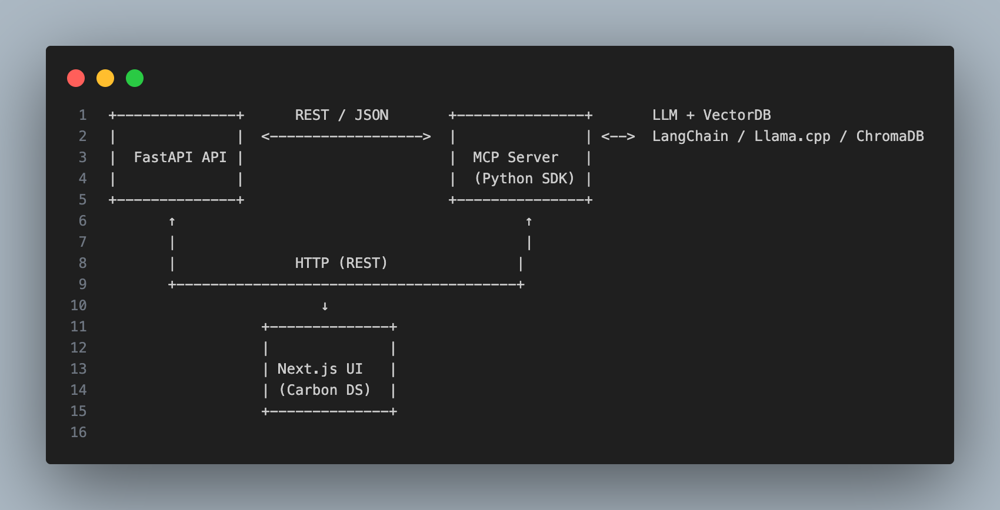

# NoteTaker
Simple CRUD app using MCP, Langchain, FastApi

### Architecture



#### Data model
```
{
  "id": "uuid",
  "title": "string",
  "content": "string",
  "tags": ["string"],
  "summary": "string",
  "created_at": "timestamp",
  "updated_at": "timestamp"
}
```

#### UseFul Commands

```
uv venv .venv --python=3.12.11
Creates a venv with specified Python version
uv pip install -r requirements.txt
Installs packages into your uv venv
uv run uvicorn main:app --reload
Runs your FastAPI app inside the uv venv
uv sync --activate

```

# Run Fast-API Server:
```uv run uvicorn main:app --reload --port 8000```

# Run MCP Server:
```uv run uvicorn main:app --reload --port 8001```

### MCP Server

-- LLM Integration- Summarizes and tags note content using OpenAI or a local model
-- Vector Embedding - Converts notes into vector embeddings for semantic search
-- Indexing & Storage - Stores vectors and metadata in a local vector database (e.g., ChromaDB)
-- Semantic Search - Returns relevant notes by comparing vector similarity with a query
-- Clean API Contract - Decouples LLM + vector DB logic from your main FastAPI CRUD server


### Workflow

### When a note is created:

- FastAPI sends title + content to POST /summarize in MCP.

MCP:

• Calls OpenAI to generate summary and tags

• Embeds the note using OpenAI embeddings or local model

• Stores it in vector DB via POST /index

FastAPI stores the returned summary/tags and returns note to UI.


When a user performs a search:

FastAPI sends the query to POST /search in MCP.

MCP Server role:

• Embeds the query text

• Searches vector DB for top-k similar notes

• Returns list of {id, score} to FastAPI

FastAPI uses those IDs to fetch and return full notes to UI.


Benefit of using separate MCP server

Why It Matters

-- Security

- Your LLM/API keys are only stored in MCP

-- Modularity

- Easy to swap vector DBs or LLM models

-- Isolation for Testing

- Can test smart features without touching CRUD logic

-- Scalability

- Can run MCP separately and scale it for heavy compute usage

### INSTALL and Run Model Locally

``` brew install ollama ```

### TAB - 1
``` ollama serve ```

### TAB - 2

``` ollama pull llama2 ```
